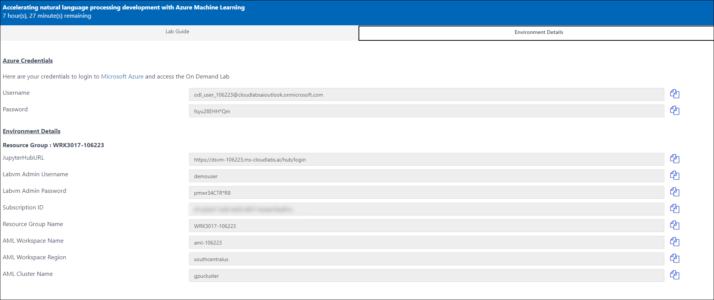

# Exercise 0: Login to your Jupyterhub Portal.
In this exercise you will Log into your **jupyterhub portal** Login using your labvm username and Password from your Environment details page.
1. Click on Environment Details Tab on this Page to view your Azure Lab credentials details. Use these deatils to login into the JupyterHub Portal. 

### Login to Jupyterhub Portal

1. Copy the jupyterhub URL from your Lab credentials details and navigate it in a new tab.

1. Login using your Labvm Admin Username and Labvm Admin Password from your Lab credentials details in the Jupyterhub portal. After entering your credentials click on **Sign In** button. 

1. Now you will able to see your jupyterhub portal home page. 

1. Select the **nlp** folder.

1. Select **examples** folder .

1. Select **text_classification** folder.

1. open folder **tc_transformers_azureml_pipelines**.

1. click on **tc_transformers_azureml_pipelines.ipynb**.

